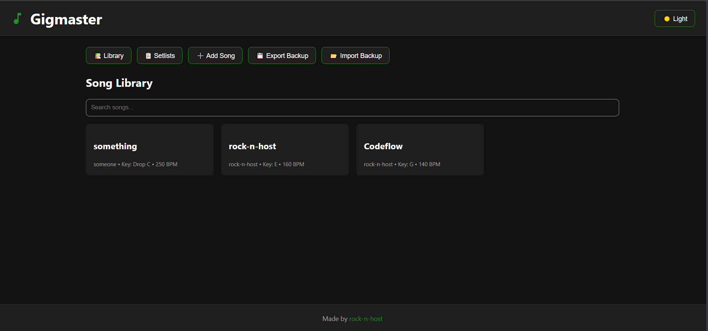
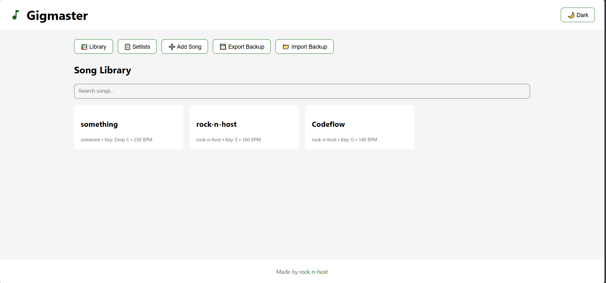
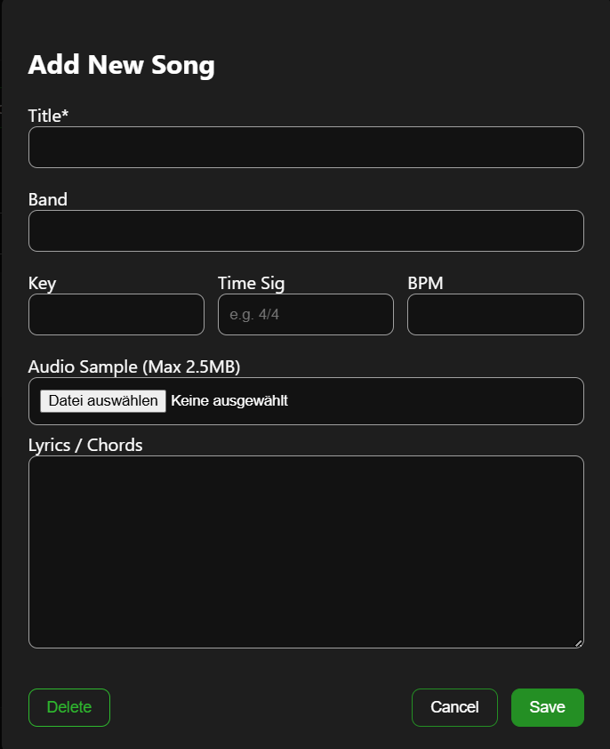
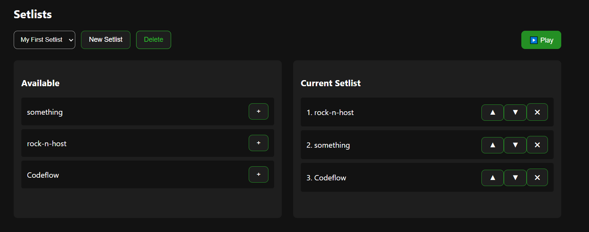

<div align="center">
  
  <h1>Gigmaster</h1>
  <p><strong>A simple, self-hosted lyrics library without dependenvies.</strong></p>

  
</div>

---

## Overview

**Gigmaster** is a lightweight, responsive web application designed to manage and display lyrics during gigs or rehearsals. It is built to be self-hosted and uses a simple flat-file structure. My goal was to make it as simple as possible so no external frameworks are used, only pure HTML, CSS and javascript.

### Features
* **Light and Dark Mode UI:** Optimized for low-light environments as well as outdoor places with daylight.
* **Card Grid Layout:** Easy touch navigation for song selection.
* **Flat-File structure:** Lyrics are stored inside `indexedDB` in the Browser and can be imported / exported as JSON. The application itself is just one html file containing everything.
* **Settings:** Simple settings window for the theme, audio click and scroll speed
* **Samples view:** Browse and play only the songs with attached audio samples, with search by song or artist.





---

## Usage

Right-click the index.html file and open with a Browser. Everything loads instantly.

If you want to host it with Nginx, Apache or something else, modify the docker-compose.yml, then
1.  run:
    ```bash
    docker-compose up -d
    ```
2. go to ``` http://localhost:8080 ```.
---

## Adding Songs

You can drag and drop songs via the **"Add Song"** button in the **Library** tab, or by importing from the JSON.



## Adding Setlists

There is a default Setlist that can be edited. New ones can be added and also removed. The "Play Setlist" feature displays Songs in order and allows switching to the previous/next one.



---

## Audio playback

Loading audio files as backing tracks is also supported. Audio files are stored as base64 "Text" directly in the same JSON. Your browser converts them back to audio in real time.

Use the **Samples** tab to quickly audition attached audio without opening the full lyrics view. Starting a sample automatically pauses any other active audio player.

---

## TODO

- centralized DB and json backups inside Docker Containers

---

<div align="center">
  Built by <a href="https://github.com/rock-n-host">rock-n-host</a> with some help from Gemini.
</div>
